# Proyecto: Muestra de imagenes en matriz de leds dependiendo de la temperatura

Como dice el nombre, este proyecto busca hacer que dependiendo de la temperatura que lea un sensor se muestren diferentes imagenes en una pantalla, para hacer esto posible se usará una matriz de leds de 64x64 en la cual se mostrarán imagenes que contengan 12 bits por pixel y un sensor de temperatura y humedad AHT10 puesto que el protocolo de communicación que usa este sensor es I2C.

A continuación una breve explicación de las bases para el funcionamiento del proyecto.

## Interfaz de conexión HUB75E

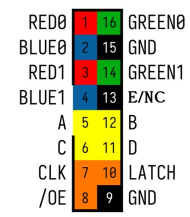

La interfaz de conexión HUB75E es un conector que consiste de 16 pines utilizado en matrices LED RGB para transmitir datos y señales de control, incluye seis líneas de datos (R0/1, G0/1, B0/1) las cuales envian los bits de color a dos filas simultáneas del panel, además de las líneas de selección (A, B, C, D) que determinan qué grupo de filas se activa en cada ciclo, están las señales de control CLK, LATCH y /OE que permiten sincronizar la carga de datos y el encendido de los LEDs, mientras que los pines GND sirven como referencia a tierra. Es esta combinación de señales la cual permite refrescar la pantalla rápidamente mediante multiplexación por filas.

La imagen sacada fue obtenida del libro proporcionado por el profesor.

## Protocolo de comunicación I2C

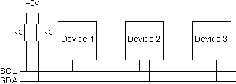

En esta imagen se muestra la conección de los dispositivos que se usarán con el protocolo I2C, en esta se puede ver como se establece el bus de comunicación que se compone por dos líneas compartidas: SCL (reloj) y SDA (datos). Ambas líneas son de tipo open-drain/open-collector, por lo que es necesario el uso resistencias de pull-up (Rp) que las mantienen en nivel alto cuando ningún dispositivo las está usando. Todos los dispositivos (tanto el maestro como uno o varios esclavos) se conectan en paralelo a estas dos líneas, lo cual permite una comunicación entre dispositivos sin conflicto mientras solo un maestro controla el reloj.

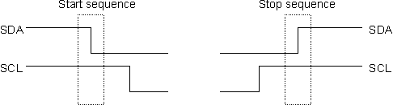

Para este protocolo hay condiciones especiales para dar un inicio y un fin a la comunicación. La condición de START (S) ocurre cuando SDA pasa de alto a bajo mientras SCL está alto, indicando a todos los dispositivos que empieza una transmisión. La condición de STOP (P) ocurre cuando SDA pasa de bajo a alto mientras SCL está alto, señalando el final de la comunicación y liberando el bus. Estas dos secuencias son esenciales para enmarcar los mensajes y coordinar el acceso al bus I2C y su forma es la que se muestra en la imagen anterior.

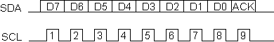

Una vez sabiendo las condiciones de inicio y fin, es necesario ver cómo se transmite un byte en este protocolo: la línea SDA envía los bits desde D7 hasta D0, cambiando su valor únicamente mientras SCL está en nivel bajo, y cada bit es leído en el flanco alto de SCL. Después de los 8 bits de datos, el transmisor libera SDA y el receptor genera el noveno pulso de reloj para enviar el bit ACK (nivel bajo) o NACK (nivel alto), indicando si recibió correctamente el byte, el transmisor o receptor puede cambiar entre maestro y esclavo dependiendo de si el maestro va a escribir o leer sobre un esclabo.

Al iniciar una comunicación lo que suele ocurrir es que tras la condición de incio se envia la dirección del esclavo con el que se quiere comunicar, siendo esta los bits de D7 a D1, mientras que D0 determinará si el esclavo será leido o si se escribira sobre este. Cuando se escribe la dirección para escritura, el maestro enviará lo que quiere escribir byte a byte esperando el correspondiende ACK antes de mandar la condición de parada, mientras que cuando se escribe la dirección para lectura, una vez enciada esta el maestro empezará a leer byte a byte lo que se envia por SDA mientras que manda los correspondientes ACK; cuando no quiera leer más del esclavo el maestro enviará un NACK seguido de la condición de parada. 

Las imagenes usadas fueron sacadas de:

(https://www-robot--electronics-co-uk.translate.goog/i2c-tutorial?_x_tr_sl=en&_x_tr_tl=es&_x_tr_hl=es&_x_tr_pto=tc)

## Sensor de humedad y temperatura AHT10

A continuación se muestra la forma en la que el sensor AHT10 se comunica mediante el protocolo I2C

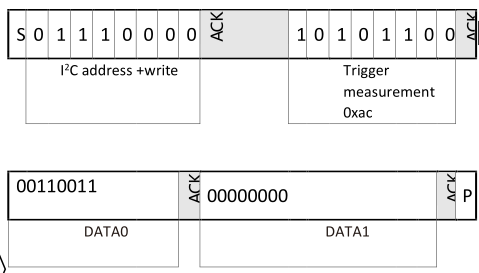

Para la escritura de datos primero se envia un byte address para indicar que se va a escribir en el esclavo, posteriormente se envian tres bytes, uno de comando y dos de parametros.

Para la configuración/calibración se envian los bytes 0xE1, 0x08, 0x00 mientras que para iniciar una medición se envian los bytes 0xAC, 0x33 0x00.

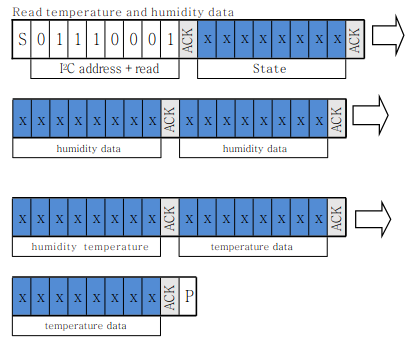

Para la lectura de datos primero se envia un byte address para indicar que se va a leer el esclavo, a lo cual el esclavo regresará 6 bytes, el primero se le llama byte de estado (el cual no se considerará en este caso), el segundo y tercero contienen datos de humedad, el cuarto contiene datos tanto de humedad como de temperatura mientras que el cuarto y quinto contienen datos de temperatura

Imagenes tomadas del datasheet del sensor:
(https://altronics.cl/uploads/AHT10.pdf)

## Diagramas de matriz de leds 12bpp

A continuación se muestran los diagramas se usarán para estructurar el funcionamiento de la pantalla, no se profundizará demasiado en estos puesto que se basan casi en su totalidad en los proporcionados por el profesor, sufriendo solo el camino de datos una leve alternación.

### Diagrama de flujo

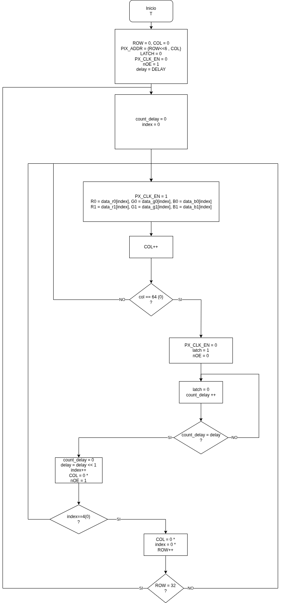

En este diagrama se puede ver como primero se inician las variables que se usarán para determinar como se envia la información,luego se determinan los datos que serán enviados a una fila columna a columna, estos datos se muestran en la matriz y luego se tiene un pequeño receso antes de enviar los datos de la siguiente fila, lo cual se repite indefinidamente para que desde el ojo humano se pueda ver claramente una imagen.

### Camino de datos

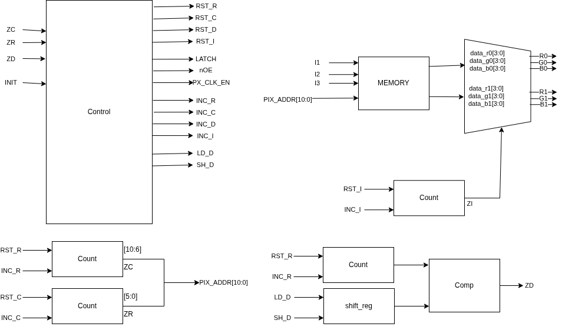

En el camino de datos se puede ver el bloque de control con el cual se determinan cuando cambian las diferentes variables, contadores controlados por el bloque de control, un bloque de comparación, uno de memoria donde se guardan las imagenes y un multiplexor para mandar los datos de forma correcta a la pantalla.

El cambio mencionado previamente es el hecho en este diagrama, donde se agregaron las entradas I1, I2, I3 al bloque de memoria, lo cual hará que dependiendo de cual entrada se encuentre activa, una imagen diferente se cargará en la salida de la memoria para la matriz.
	
### Diagrama de estados

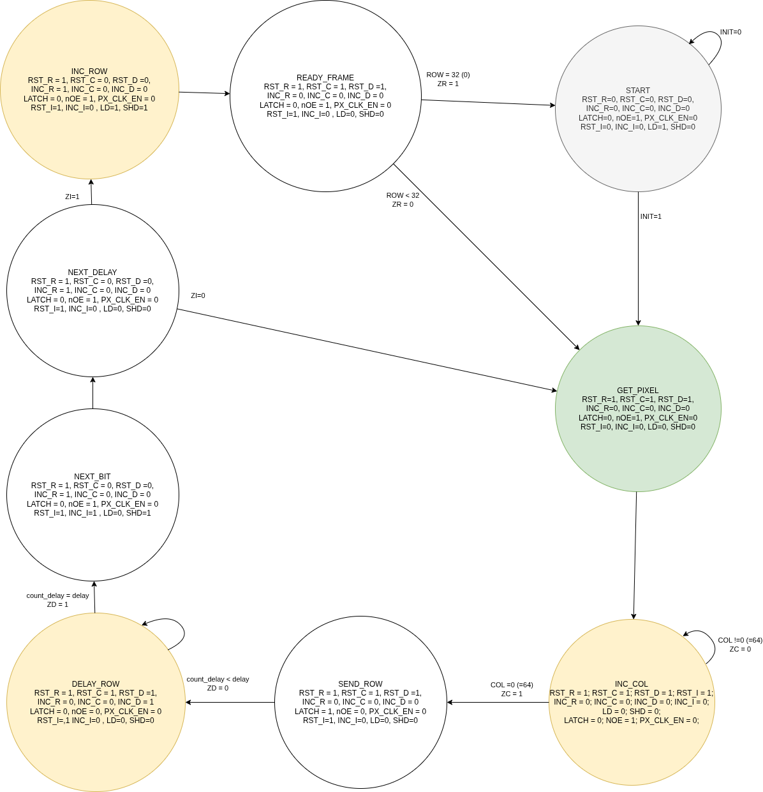

El proceso del diagrama de estados inicia en START, donde se resetean contadores y se prepara el sistema, luego en GET_PIXEL se leen los datos del píxel correspondiente a la fila y columna actuales. Después, en INC_COL y SEND_ROW, se envía bit a bit la información RGB hacia el panel mientras el reloj y las señales de control generan los pulsos necesarios. Cuando una columna completa ha sido transmitida, se pasa a DELAY_ROW, que mantiene la fila encendida por el tiempo asociado al peso del bit actual, es decir, para aplicar PWM. Luego, en NEXT_BIT, se avanza al siguiente bit de importancia del color y se repite el ciclo. Una vez enviados todos los bits de PWM, INC_ROW avanza a la siguiente fila, y el proceso continúa hasta completar todas las filas, regresando finalmente a READY_FRAME para iniciar un nuevo refresco y mantener estable la imagen en pantalla.

## Diagramas sensor de temperatura AHT10

A continuación se muestran los diagramas se usarán para estructurar el funcionamiento del sensor de temperatura y humedad AHT10.

### Diagramas de flujo

Se usaron dos diagramas de flujo para representar el funcionamiento, esto para facilitar la representación del hecho de que se usa repetidas veces el protocolo I2C para enviar o recibir datos.

#### Diagrama de flujo para protocolo I2C

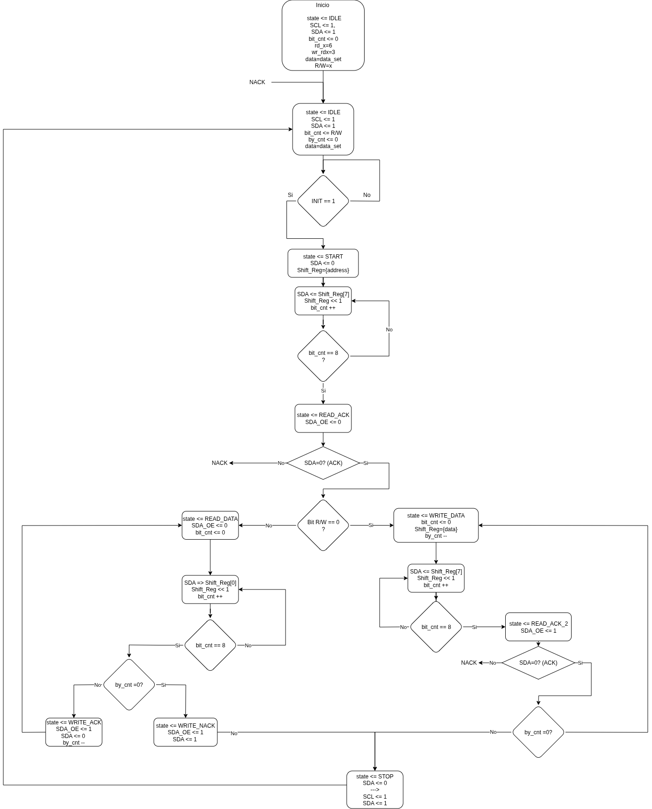

En este primer diagrama de flujo se establece como tal el funcionamiento del protocolo I2C. Primero se inician los contadores que se van a usar, luego se va a un estado de inactividad hasta que se de una señal de inicio para comenzar con la comunicación por protocolo; Una vez que se cumple con la indicación de INIT, se envia la condicion de de inicio por SDA y se carga un byte de address el cual puede ser para indicar lectura o escritura. Lo siguiente es enviar cada bit de address usando el contador y una vez se han mandado todos, se revisa si esto fue recibido por el esclavo correctamente al leer el ACK, de no recibir un ACK, se regresa a IDLE.

Tras recibir un ACK, lo siguiente que se debe hacer depende de si el address indicaba lectura o escritura:

* Lectura: Si se va a leer, lo primero es que el maestro suelte SDA para que el esclavo pueda manejarlo libremente y reiniciar el contador de bit, antes se uso para saber cual bit de address se estaba enviando, pero en este caso se usará para saber cuantos bits se han leido y guardado en un registro. Una vez leidos todos los bits enviados por el esclavo, se usa un contador llamado by_cnt, el cual determina si hay más bytes de datos que se van a leer; Si faltan bytes por leer, el maestro enviará un bit de ACK, decrecerá by_cnt y se hará una preparación para leer otro byte de datos, si no faltan bytes por leer, se procederá a mandar un bit NACK y a terminar la comunicación con una condición de parada.
* Escritura: Cuando se va a escribir en el esclavo el proceso es el mismo al de enviar el byte de address, se reinician contadores, se carga un byte para ser enviado bit a bit y se espera un ACK del esclavo para ver si se regresa a IDLE o se sigue, la diferencia aqui es que luego de enviar un byte se verifica si falta mandar más bytes al sensor, en caso de faltar, usando el contador se cargará el siguiente byte que debe ser enviado, pero si no faltan se procede a terminar la comunicación con la condición de parada.

Una vez que se ha terminado la comunicación debido al bit de parada se regresa al estado de IDLE, sin embargo, para aplicar esto de forma correcta al sensor es necesario hacer algunos ajustes a lo que se va a enviar, lo cual se muestra en el siguiente diagrama de flujo.

#### Diagrama de flujo para sensor AHT10

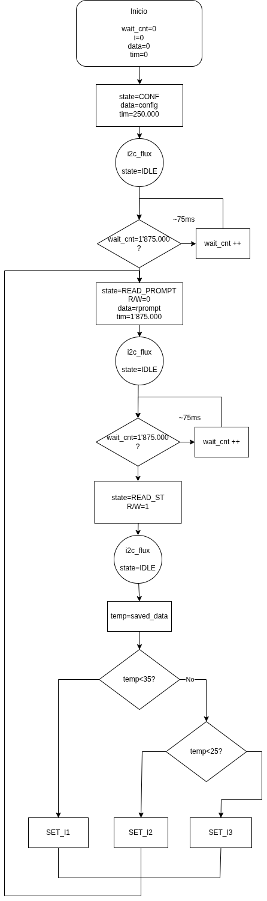

Este diagrama de flujo es más sencillo que el anterior debido a que su objetivo es explicar pequeños ajustes en los bytes que se van a enviar al sensor por medio del protocolo I2C, cabe aclarar que "i2c_flux" es una forma de representar que en ese punto se inicia el proceso del diagrama de flujo visto previamente desde el estado IDLE y se regresa a este diagrama una vez se pasa STOP. En el inicio se establecen los contadores y registros que se van a usar, entre estos el que más destaca es "data" debido a que es donde se representa la carga de los bytes que serán enviado, una vez aclarado eso es posible ver como se desarrolla el diagrama.

Lo primero que se hace en cuanto todo el sistema recibe energia es configurar el sensor, por lo cual  se cargan los bytes de configuración en data y se prosigue con todo el proceso para enviar la información en el protocolo I2C. Una vez que se envian todos los bytes y se da la condición de parada es necesario esperar unos cuantos milisegundos para que el sensor se calibre, en cuanto se termine la espera se cargan los bytes que le indian al sensor que debe iniciar una medida, se hace el proceso de envio de datos por protocolo y se vuelve a entrar en un estado de espera. Cuando el tiempo de espera para la medida ha terminado se carga el byte para leer el sensor (el cual solo es el byte de address con la indicación de lectura) y se hace el proceso del protocolo, sin embargo esta vez en lugar de enviar datos, el maestro gruardará lo que entre por SDA en un registro interno.

Tras haber hecho el proceso de lectura se hacen dos comparaciones con el valor de temperatura tomado del registro guardado y dependiendo de eso, se establece cual de las salidas I1, I2 o I3 se mantendrá activa en lo que se vuelve a hacer la toma de datos. Despues de la lectura no hay necesidad de esperar un tiempo, por lo cual en cuanto se defina cual salida estará activa, se regresa al momento en el que se le ordena al sensor para iniciar una medida.

### Camino de datos

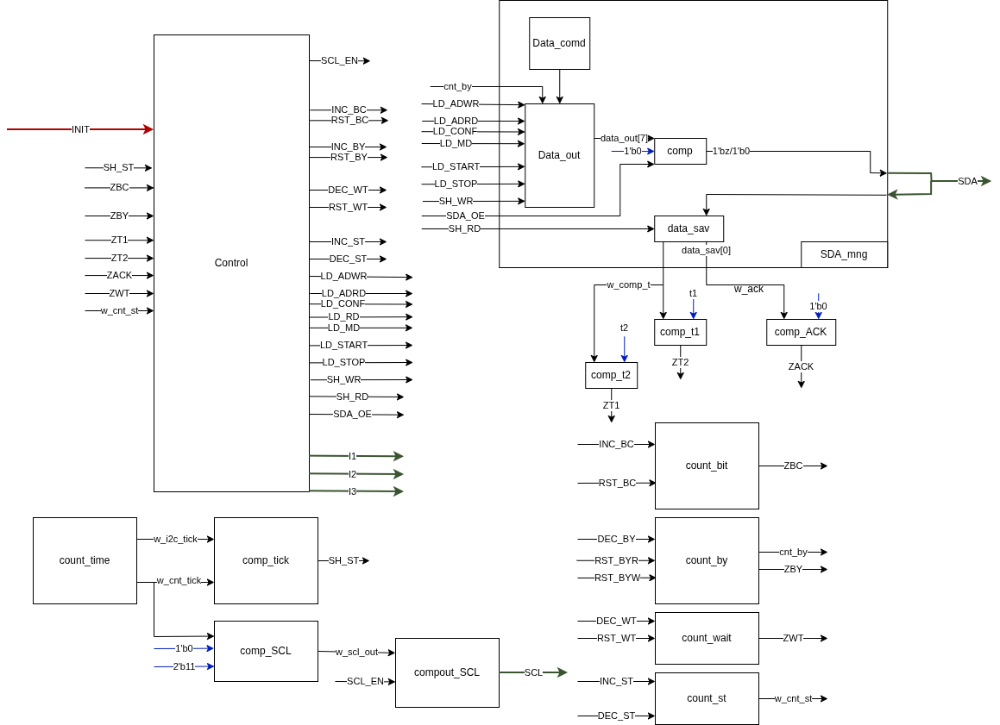

Es posible subdividir el camino de datos en cinco partes para tener una mejor comprensión del mismo:

* Calibrador de tiempo (Bloques azules): El calibrador de tiempo tiene como objetivo generar SCL y una señal "SH_ST", la cual determinará cuando se cambia de estados y el tiempo que estarán activas ciertas señales durante un estado, "count_time" es un contador que siempre contará cierto número de ticks y aumentará "cnt_tick" cada vez que el contador sea igual a ese número de ticks, además de tener como salida el conteo "cnt_tick" también tiene como salida el instante en el que se cumple la igualdad, lo cual se lleva a "comp_tick", que hará que cuando "cnt_tick" sea igual a un valor y se de el instante de igualdad, "SH_ST" se active.
"Comp_SCL" hace que dependiendo del valor de "cnt_tick" se suba o se baje la señal "scl_out", y finalmente comput_SCL hará que la salida SCL actue normalmente cuando "SCL_EN" sea igual a 1 pero que se mantenga en 1 cuando "SCL_EN" sea 0.
* Contadores (Bloques naranjas): Se tienen cuatro bloques contadores, "count_bit" toma nota de cuantos bits del byte se han enviado, "count_by" toma nota de cuantos bytes fuera del de address se han escrito o leido además de determinar cual byte se esta enviando con "cnt_by", "count_wait" se usa para el tiempo de espera que tiene que haber luego de la configuración y la orden para tomar una medida y "count_st" se usa para determinar si se esta configurando, dando la orden de medida, o leyendo al esclavo (Sensor AHT10).
* Manejo de datos (Bloque amarillo): Este bloque se encarga tanto de generar la salida como de la lectura de SDA por parte del maestro, los bloques internos que se muestran solo para representar mejor el funcionamiento de este. Para la salida de datos de SDA lo que ocurre es que al bloque le llega "SDA_OE", esto hace que el maestro fuerce los datos en SDA. Los bits que van a ser enviados en son guardados en un registro el cual carga esos bits con la señal respectiva de "LD" y si es necesario, usando "cnt_by", los bits enviados van cambiando con "SH_WR" para ser pasados por un comparador cuyo objetivo es que en vez de mandar 1 y 0 el maestro envie z y 0, forzando asi 0 para cada 0 y soltando la linea con z para cada 1. Para la lectura de datos se hace que el maestro suelte la linea (SDA=Z) y empiece a guardar los datos en un registro usando "SH_RD".
* Comparadores (Bloques verdes): Hay tres bloques de comparadores (sin contar los del tiempo), dos de estos comparan el valor de temperatura obtenido al revisar ciertos bits del resultado de la medida del sensor ("comp_t1","comp_t2") y el otro revisa si se recibe el bit ACK del esclavo.
* Control (Bloque rojo): Este bloque se encarga de determinar en que momento se activa cada señal dependiendo de los valores de entrada y el estado actual, es importante destacar que de aqui salen las señales que determinan que imagen sale en la matriz de leds.

### Diagrama de estados

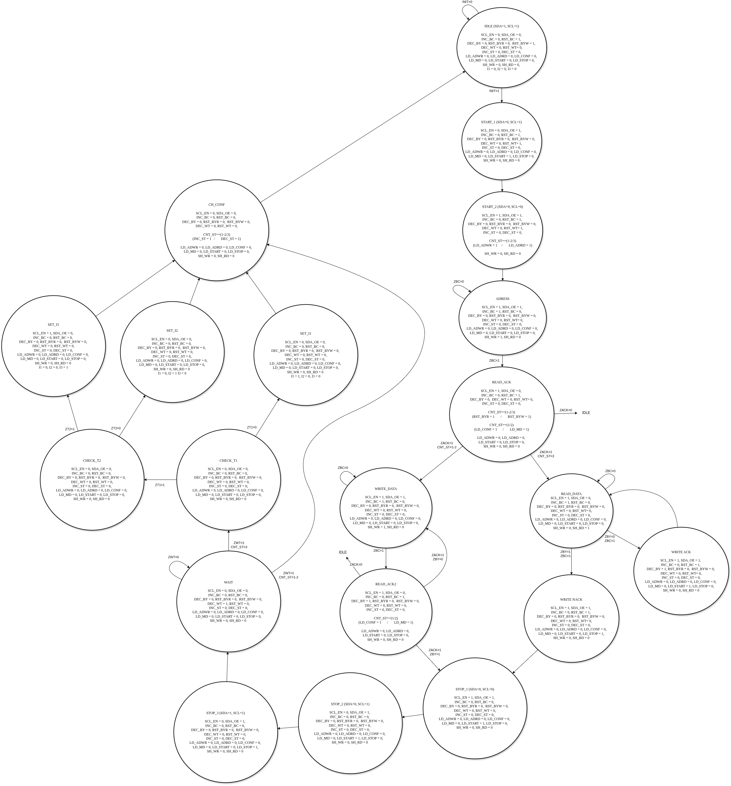

Para entender el diagrama de estados se hará una breve explicación de cada estado:

* IDLE: Se espera la señal de inicio, SDA y SCL se mantienen en "1"
* START_1: SDA es forzado a 0, se mantiene SCL en "1" y se carga el byte address de lectura/escritura según corresponda
* ADDRESS: Se envia el byte address correspondiente.
* READ_ACK: Se verifica que el sensor envie un ACK, se establece el conteo de bytes y se cargan los bytes dependiendo si se va a configurar o a iniciar una medida. Si no se recibe un ACK, se regresa a IDLE
* WRITE_DATA: Se envia el byte cargado bit a bit
* READ_ACK2: Se verifica nuevamente que el sensor haya enviado un ACK para determinar si se va a IDLE o se sigue con el proceso, además de eso se cambia el contador de byte y se carga el nuevo byte a enviar en el estado de WRITE_DATA, si ya se han enviado todos los byres se procede a STOP_1
* READ_DATA: Se guardan los bits enviados por el esclavo mediante SDA en un registro, si el contador de bytes determina que aun no se han leido todos los bytes, se procede a WRITE_ACK, por el contrario, se procede a WRITE_NACK
* WRITE_ACK: Se envia un bit ACK por SDA, además se cambia el contador de byte y se procede de nuevo a READ_DATA
* WRITE_NACK: Se envia un bit NACK por SDA y se procede a STOP_1
* STOP_1: Se fija el reloj a 1 y se fuerza SDA a 0
* STOP_2: Se fija el reloj a 1 y se suelta SDA
* WAIT: Aumenta un contador y se mantiene hasta que haya pasado un tiempo
* CHECK_T1: Compara el valor de temperatura obtenido del sensor con uno guardado, si no se cumple la condición, se pasa a SET_I1
* CHECK_T2: Compara el valor de temperatura obtenido del sensor con uno guardado, este valor es menor al que contiene T1, de no cumplirse la condición se pasa a SET_I2, de cumplirse, se pasa a SET_I3
* CH_CONF: Aqui se cambia el "cnt_st", contador el cual determina que bytes se van a enviar mediante el protocolo. La primera vez que se llega a este estado "cnt_st" es igual a 1, que es la configuración para inicializar el sensor, en este momento "cnt_st" cambia a 2, lo cual determina la configuración de escritura en el siguiente ciclo; cuando se acaba el ciclo de escritura "cnt_st" cambia a 3, lo cual determina la configuración de lectura y una vez que se termina el ciclo de lectura "cnt_st" vuelve a 2, lo cual repite el ciclo de lectura y escritura.
